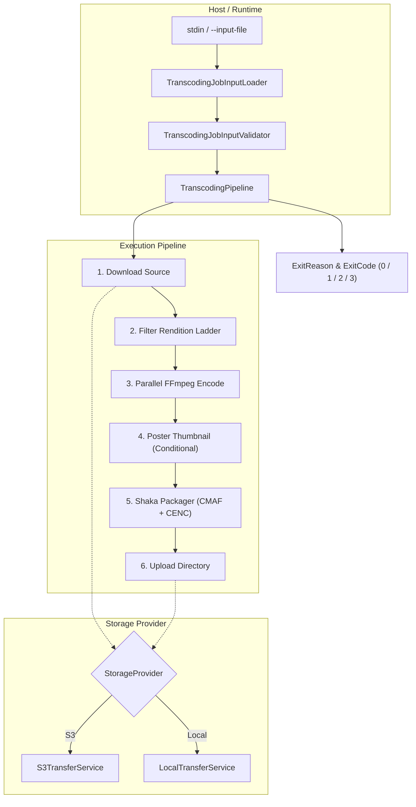

# ffmpeg-hls-transcoder

[](https://dotnet.microsoft.com/)
[](https://learn.microsoft.com/en-us/dotnet/core/deploying/native-aot/)
[](https://www.docker.com/)
[](LICENSE)

A high-performance, containerized, run-once video transcoding worker designed for cloud ingestion pipelines and local testing. It encodes an Adaptive Bitrate (ABR) rendition ladder using **FFmpeg**, packages **CMAF/fMP4 HLS** playlists and segments with **Shaka Packager** (offering parity with AWS Elemental MediaConvert), generates poster thumbnails, and supports raw-key **CENC (Common Encryption)**.

Compiled ahead-of-time with **Native AOT** for instant startup and low memory footprint on serverless containers like AWS ECS Fargate.

---

## Features

- **Parallel Rendition Encoding**: Runs concurrent FFmpeg encodes per rendition with CRF-capped QVBR-equivalent quality targeting, universal player compatibility (`yuv420p`), and keyframe-aligned GOPs.
- **CMAF/fMP4 Parity**: Generates fragmented MP4 HLS streams, master playlists (`master.m3u8`), variant playlists, separate audio groups, and I-frame only trick-play manifests (`*_iframe.m3u8`).
- **Raw-Key CENC Encryption**: Built-in support for Common Encryption (CENC) via Shaka Packager with ISO-BMFF protection boxes (`encv`, `sinf`, `schm`, `schi`, `tenc`, `pssh`).
- **Pluggable Storage Backends**: Configurable `StorageProvider`:
  - `S3`: Production transfers using Amazon S3 `TransferUtility` with multi-part, concurrent downloads and uploads.
  - `Local`: Zero-dependency local filesystem copy for local testing and development.
- **Smart Thumbnail Generation**: Generates a high-quality poster JPEG using keyframe seeking if `ThumbnailRelativeUrl` is absent, or skips generation if an existing thumbnail is provided.
- **Strict Exit Contract**: Designed for AWS Step Functions (`arn:aws:states:::ecs:runTask.sync`) with deterministic process exit codes (`0`, `1`, `2`, `3`).
- **CloudWatch-Ready Structured Logging**: Single-line structured log output with sensitive encryption key redaction.
- **Native AOT Compiled**: Sub-second startup time, ~14 MB standalone binary, no .NET runtime dependency required in production.
- **Self-Contained Dockerfile**: Pinned dependencies (FFmpeg + Shaka Packager) with multi-architecture support (`amd64` / `arm64`) and non-root execution.

---

## Architecture & Pipeline



---

## Getting Started

### Prerequisites

#### Local Development
- [.NET 10 SDK](https://dotnet.microsoft.com/download/dotnet/10.0)
- [FFmpeg](https://ffmpeg.org/download.html) (on system `$PATH`)
- [Shaka Packager](https://github.com/shaka-project/shaka-packager/releases) (on system `$PATH` or configured via options)

#### Containerized Execution
- [Docker](https://docs.docker.com/get-docker/) (builds without any host dependencies)

---

### Quick Start (Local)

1. **Clone the repository:**
   ```bash
   git clone https://github.com/Azero77/ffmpeg-hls-transcoder.git
   cd ffmpeg-hls-transcoder
   ```

2. **Prepare a sample job configuration (`job.json`):**
   ```json
   {
     "videoId": "a1b2c3d4-e5f6-7890-abcd-ef1234567890",
     "tenantId": "11111111-2222-3333-4444-555555555555",
     "sourcePath": "/path/to/source-video.mp4",
     "outputPrefix": "/path/to/output-directory",
     "sourceMetadata": {
       "sourceWidth": 1920,
       "sourceHeight": 1080,
       "duration": "00:05:00"
     },
     "encryptionMethod": "None",
     "thumbnailRelativeUrl": null,
     "settings": {
       "outputs": [
         { "width": 1920, "height": 1080, "maxBitrateKbps": 6000, "qvbrQualityLevel": 7, "nameModifier": "_1080p" },
         { "width": 1280, "height": 720,  "maxBitrateKbps": 3500, "qvbrQualityLevel": 7, "nameModifier": "_720p" },
         { "width": 854,  "height": 480,  "maxBitrateKbps": 1500, "qvbrQualityLevel": 7, "nameModifier": "_480p" },
         { "width": 640,  "height": 360,  "maxBitrateKbps": 800,  "qvbrQualityLevel": 7, "nameModifier": "_360p" }
       ],
       "segmentLengthSeconds": 6,
       "fragmentLengthSeconds": 2,
       "audio": {
         "codec": "aac",
         "bitrateKbps": 128,
         "sampleRate": 44100
       }
     }
   }
   ```

3. **Run using local storage:**
   ```bash
   export TRANSCODER__StorageProvider=Local
   export TRANSCODER__INPUT_FILE=./job.json
   dotnet run --project src/App/App/App.csproj
   ```

---

### Running with Docker

The [`Dockerfile`](file:///home/azero/Desktop/ffmpeg-hls-transcoder/src/App/App/Dockerfile) is fully self-contained, installing all dependencies (including `clang` for Native AOT, `ffmpeg`, and pinned `shaka-packager` v3.5.0):

```bash
# Build the Docker image
docker build -t ffmpeg-transcoder-hls:latest src/App/App

# Run locally mounting input and output volumes
docker run --rm -i \
  -v /local/videos:/media/input:ro \
  -v /local/hls-output:/media/output \
  -e TRANSCODER__StorageProvider=Local \
  ffmpeg-transcoder-hls:latest < job.json
```

---

## Configuration Reference

Configuration can be set via [`appsettings.json`](file:///home/azero/Desktop/ffmpeg-hls-transcoder/src/App/App/appsettings.json) or overridden with environment variables using the `TRANSCODER__` prefix.

| Parameter | Environment Variable | Default | Description |
|---|---|---|---|
| `StorageProvider` | `TRANSCODER__StorageProvider` | `Local` | Transfer backend: `Local` (filesystem) or `S3` (Amazon S3). |
| `MaxEncoders` | `TRANSCODER__MaxEncoders` | `4` | Maximum parallel FFmpeg encode processes. |
| `PackagerBinaryPath` | `TRANSCODER__PackagerBinaryPath` | `packager` | Executable path or name for Shaka Packager. |
| `FFmpegBinaryPath` | `TRANSCODER__FFmpegBinaryPath` | `ffmpeg` | Executable path or name for FFmpeg. |
| `ThumbnailSeekSeconds` | `TRANSCODER__ThumbnailSeekSeconds` | `5` | Seek offset in seconds for poster frame capture. |
| `S3:InputBucket` | `TRANSCODER__S3__InputBucket` | `""` | S3 bucket where source video resides (required for `S3`). |
| `S3:OutputBucket` | `TRANSCODER__S3__OutputBucket` | `""` | S3 bucket where packaged HLS output is uploaded (required for `S3`). |
| `INPUT_FILE` | `TRANSCODER__INPUT_FILE` | `""` | Optional local file path for job input JSON. If omitted, input is read from `stdin`. |

---

## Job Input Contract

The worker expects a JSON payload passed either via `stdin` or specified via `TRANSCODER__INPUT_FILE`.

### Schema Specification

```csharp
public sealed record TranscodingJobInput(
    Guid VideoId,                         // Identifier used for temporary workspaces and logging
    Guid TenantId,                        // Multi-tenant routing identifier
    string SourcePath,                    // S3 key or local file path
    string OutputPrefix,                  // S3 key prefix or local destination directory
    VideoMetadata SourceMetadata,         // Source resolution and duration
    TranscodeSettings Settings,           // Rendition ladder, segment lengths, audio settings
    EncryptionMethod EncryptionMethod,    // "None" | "ClearKey"
    EncryptionSettings? Encryption,       // KeyId, Key, KeyUrl (optional)
    string? ThumbnailRelativeUrl          // Upstream thumbnail URL; if null, a poster is generated
);
```

### Raw-Key CENC Encryption Example

To encrypt streams with Common Encryption (CENC):

```json
{
  "encryptionMethod": "ClearKey",
  "encryption": {
    "keyId": "6d76f25cb17f5e16b8eaef6bbf582d8e",
    "key": "cb541084c99731aef4fff74500c12ead",
    "keyUrl": "https://keys.example.com/cenc/key"
  }
}
```

> [!NOTE]
> Encryption keys are safe to pass directly in job JSON when jobs run in an isolated VPC. Encryption keys and key IDs are automatically redacted from all application logs.

---

## Process Exit Codes & Contract

The application strictly obeys the run-once task contract for AWS Step Functions (`arn:aws:states:::ecs:runTask.sync`) and container runners:

| Exit Code | Identifier | Description |
|---|---|---|
| `0` | `Success` | All renditions encoded, packaged, uploaded, and temporary workspace deleted. |
| `1` | `Failed` | Unhandled error during download, encoding, packaging, or upload. |
| `2` | `Cancelled` | Task received `SIGTERM` (e.g. Fargate task stopped or cancelled). Clean shutdown triggered. |
| `3` | `InvalidInput` | Deserialization failure or domain validation error in `TranscodingJobInput`. |

### Structured Log Format

Logs are formatted in single-line CloudWatch-optimized output:

```text
2026-09-19T22:24:09.196Z info: App.Pipeline.TranscodingPipeline[0] [Download] Starting for 11111111-1111-1111-1111-111111111111
2026-09-19T22:24:10.857Z info: App.Pipeline.TranscodingPipeline[0] [Encode] Completed for 11111111-1111-1111-1111-111111111111 in 1.7s
2026-09-19T22:24:10.984Z info: App.Pipeline.FFmpegThumbnailGenerator[0] Thumbnail generated: .../poster.jpg (46,822 bytes)
2026-09-19T22:24:11.074Z info: App.Pipeline.ShakaPackager[0] Shaka Packager completed successfully
2026-09-19T22:24:11.075Z info: App.Program[0] Exiting: Code=0, Stage=Complete, Message=Pipeline finished successfully.
```

---

## AWS Step Functions & ECS Fargate

In an AWS Step Functions state machine, invoke this worker as an ECS task with synchronization:

```json
{
  "Type": "Task",
  "Resource": "arn:aws:states:::ecs:runTask.sync",
  "Parameters": {
    "LaunchType": "FARGATE",
    "Cluster": "arn:aws:ecs:region:account:cluster/transcoder-cluster",
    "TaskDefinition": "arn:aws:ecs:region:account:task-definition/ffmpeg-transcoder-hls",
    "Overrides": {
      "ContainerOverrides": [
        {
          "Name": "transcoder",
          "Environment": [
            { "Name": "TRANSCODER__StorageProvider", "Value": "S3" },
            { "Name": "TRANSCODER__S3__InputBucket", "Value": "my-source-bucket" },
            { "Name": "TRANSCODER__S3__OutputBucket", "Value": "my-output-bucket" }
          ]
        }
      ]
    }
  },
  "Catch": [
    {
      "ErrorEquals": ["States.TaskFailed"],
      "Next": "HandleTranscodingFailure"
    }
  ],
  "Next": "PublishCdn"
}
```

### Sizing Recommendations

| Workload Tier | Source Duration | Max File Size | Ephemeral Storage | vCPU | RAM |
|---|---|---|---|---|---|
| **Standard** | $\le$ 2 hours | $\le$ 10 GB | 20 GiB (Default) | 2 | 4 GB |
| **High** | $\le$ 4 hours | $\le$ 25 GB | 50–100 GiB | 4 | 8 GB |

---

## Building & Publishing

### Standard Build
```bash
dotnet build src/App/App/App.csproj
```

### Native AOT Publish
```bash
dotnet publish src/App/App/App.csproj -c Release
```

The output binary is produced at:
`src/App/App/bin/Release/net10.0/linux-x64/publish/App`

---

## License

This project is licensed under the MIT License — see the [LICENSE](LICENSE) file for details.
